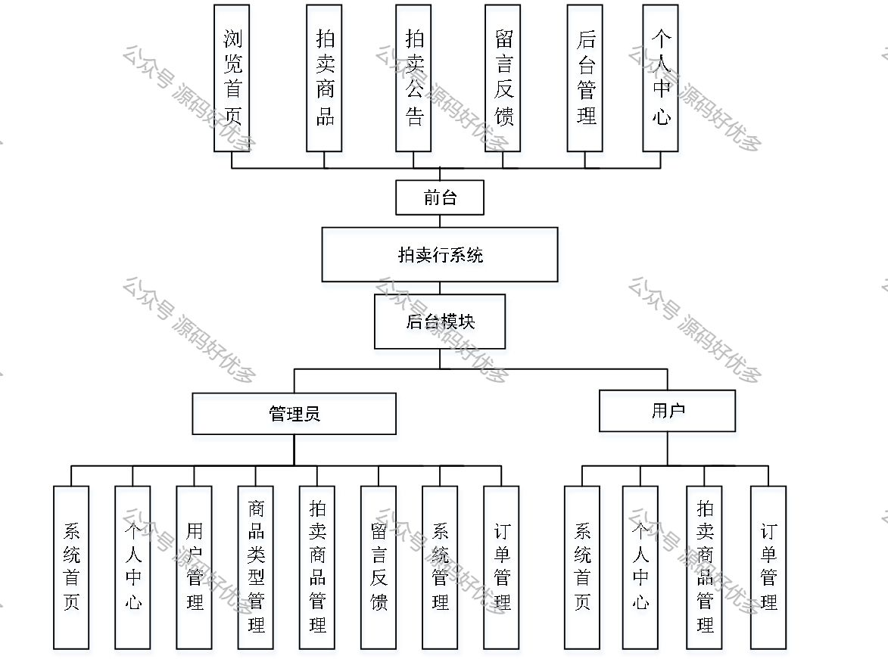
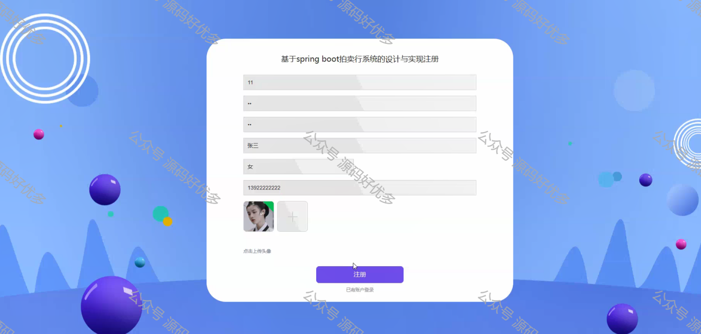
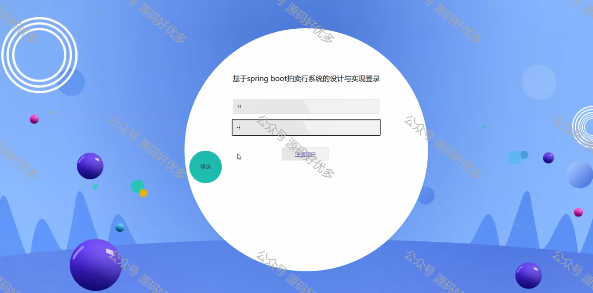
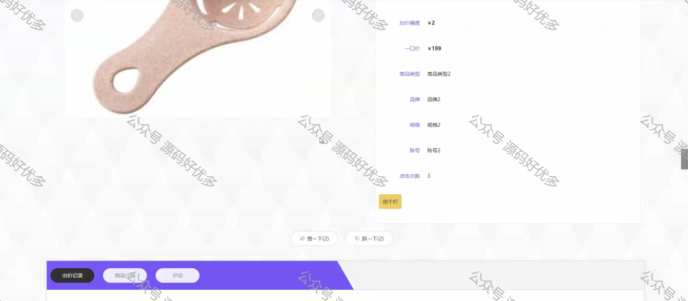
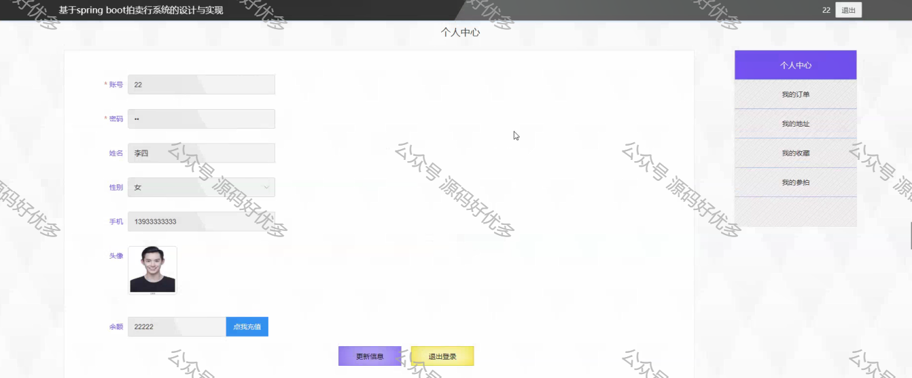
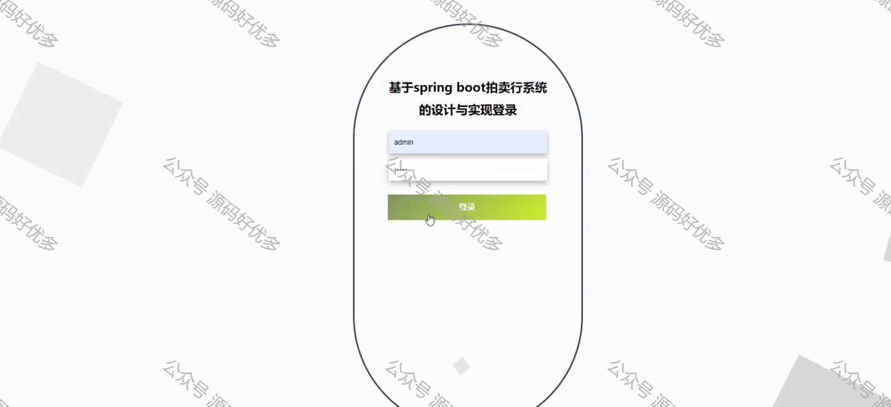
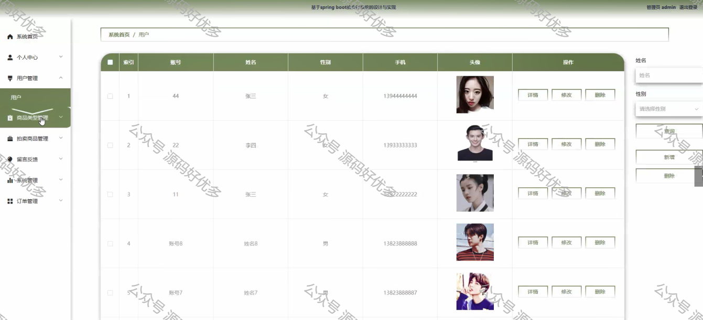
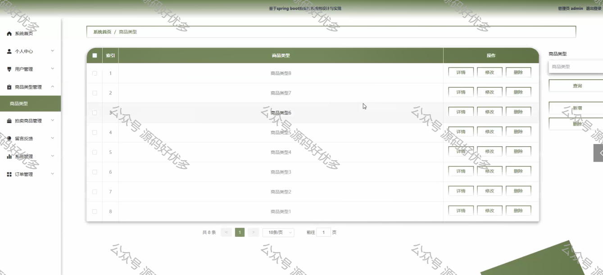
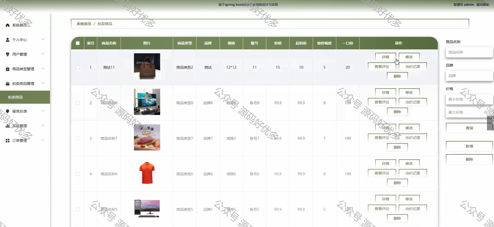

 
## 查看主页获取源码

> **作者介绍**： **✌**全网粉丝10W+本平台特邀作者、博客专家、CSDN新星计划导师、java领域优质创作者,博客之星、掘金/华为云/阿里云/InfoQ等平台优质作者、专注于项目实战 **✌**

  

### 一、作品包含

源码+数据库+设计文档万字+PPT+全套环境和工具资源+部署教程

### 二、项目技术

前端技术：Html、Css、Js、Vue、Element-ui

数据库：MySQL

后端技术：Java、Spring Boot、MyBatis

  

### 三、运行环境

开发工具：IDEA/eclipse

数据库：MySQL5.7

数据库管理工具：Navicat10以上版本

环境配置软件： JDK1.8+Maven3.6.3

前端Nodejs：14

  

### 四、项目介绍
项目编号：springbootA078

拍卖系统在提升交易效率、促进市场发展、增加交易安全性、促进文化交流等方面发挥着重要作用，是现代经济活动中不可或缺的一部分
管理员具有浏览首页、拍卖商品、拍卖公告、留言反馈、后台管理、个人中心的功能；
用户具有系统首页、个人中心、拍卖商品管理、订单管理、用户管理、商品类型管理、留言反馈、系统管理、订单管理的功能。

### 五、运行截图

  
